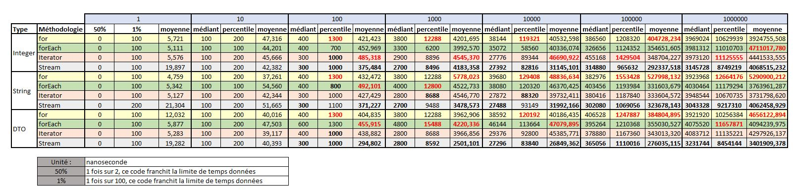

# Les boucles en Java 

## Présentation
Le but de ce projet est de se pencher sur les performances des boucles java en fonctions :
- des procédés utilisés
- de la dimension (taille) des collections
- de l'empreinte mémoire des objets

## Critères techniques 
- Version Java : 11

## Score

### Fichiers de logs 

- [sampleInteger.log](logs/sampleInteger.log)
- [sampleString.log](logs/sampleString.log)
- [sampleDTO.log](logs/sampleDTO.log)

### Résumé 

### Interprétation

- le plus rapide : stream
- le plus fiable (en temps) : stream
- le plus lent : la boucle for classique / forEach
- le moins fiable (en temps) : la boucle for classique / forEach

### Ouverture

> Le Stream est dont l'élément le plus rapide et le plus fiable. Dans des soucis d'optimisation, il est serait intéressant d'étudier les options associés (ex: parallelStream). 

